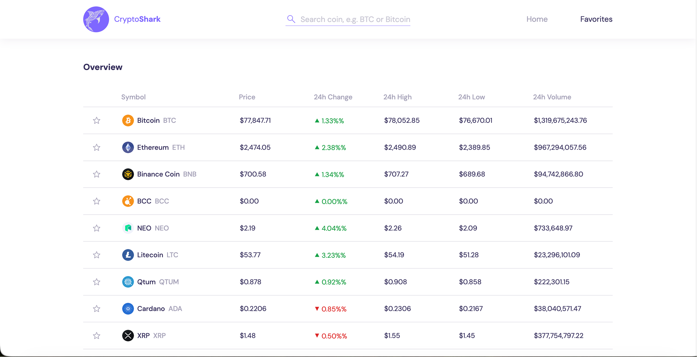

# CryptoShark 🦈

CryptoShark is a lightweight crypto market dashboard built with plain HTML, CSS, and JavaScript. It tracks USDT trading pairs from Binance, shows live market stats, and lets you search, favorite coins, and inspect order book depth for any symbol.

## Overview

This project is a front-end market overview for crypto traders and enthusiasts. It pulls public market data from Binance and keeps the UI updated in real time without a framework or build step.

## Features

- Live overview of crypto pairs paired with USDT
- Search by symbol or coin name
- Favorite coins saved in localStorage
- Real-time price and 24h change updates
- Infinite scroll for large market lists
- Order book modal with bid/ask depth
- Responsive dashboard layout
- No backend or user authentication required

## Tech Stack

- HTML5
- CSS3
- Vanilla JavaScript
- Fetch API for REST calls
- Binance Public API
- Binance WebSocket streams for live updates
- Local browser storage for favorites
- Remote crypto icon/manifest data for coin naming and icons

## Real-time Data and Live Updates

The app uses Binance WebSocket streams to receive push-based updates for the currently visible and favorited coins. This gives the dashboard a live trading feel without polling the entire market on every render.

> In practical terms, the app uses live WebSocket streams for real-time updates rather than traditional server webhooks.

## API Endpoints Used

| Endpoint               | Purpose                                                                  |
| ---------------------- | ------------------------------------------------------------------------ |
| `/api/v3/ticker/24hr`  | Full 24h stats for all trading pairs (price, % change, volume, high/low) |
| `/api/v3/ticker/price` | Lightweight current price only                                           |
| `/api/v3/depth`        | Order book (bids/asks) for a specific coin                               |

## User Experience Highlights

- Filtered search with a minimum character threshold for better UX
- Infinite scroll loads more rows as the user reaches the bottom of the list
- Favorite toggles update both the dashboard and favorites view
- Price, percent change, and volume are formatted for readability
- Coin names are resolved from a public crypto asset manifest

## Notes

- Data is read-only and intended for market monitoring only.
- No trading, account access, or order placement is included.
- Values returned by Binance are strings and are converted to numbers before formatting and calculations.
- The project is intentionally lightweight and runs directly in the browser with no dependency install step.

## Run locally

1. Clone the repository.
2. Open `index.html` in a browser.
3. If you are serving locally with a dev server, you can also run it from the project folder using any static file server.

## Project Structure

- `index.html` — app layout and dashboard structure
- `css/style.css` — custom styling and UI theme
- `js/script.js` — all data fetching, filtering, favorites, and live update logic
- `images/` — brand assets and screenshots
